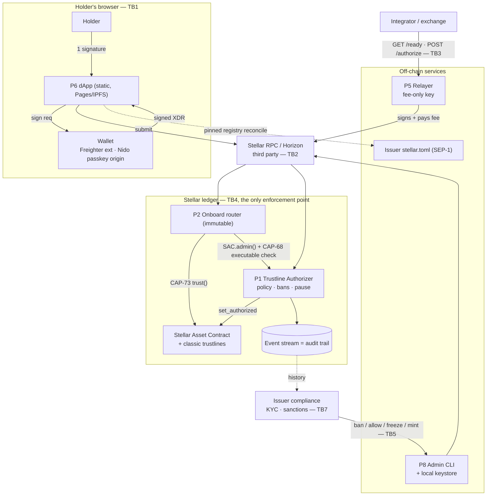

# Authline — STRIDE threat model

**What the system is, what can go wrong with it, and what we do about it.**

Status: engineering document, maintained alongside the code. Structure follows
the Stellar [STRIDE threat model template][tpl] and its four questions. Scope is
the Authline repository at the time of writing plus the deployments it defines
(`fly.toml`, `packages/relayer/Dockerfile`, the Pages/IPFS dApp workflows).

Companion documents: the [SEP draft](../sep/sep_trustlineonboarder.md) is the
protocol; the [MiCA design note](mica-authorization-model.md) is the data and
compliance posture; the [authorizer](authorizer-runbook.md) and
[relayer](relayer-runbook.md) runbooks are the operational procedures this model
assumes are followed.

[tpl]: https://developers.stellar.org/docs/build/security-docs/threat-modeling

---

## 1. What are we working on?

### 1.1 The system in one paragraph

Authline lets a holder open **and authorize** a trustline on a permissioned
(`AUTH_REQUIRED`) Stellar asset with **one signature**, and lets the issuer
enforce and evidence its admission policy on-chain. The issuer hands SAC
adminship of its classic asset to the **Trustline Authorizer** contract, which
exposes a _permissionless_ `authorize_trustline(account)` gated by a
configurable policy (denylist or allowlist) and an admin console (ban, allow,
freeze, pause, mint, clawback, upgrade) gated on the issuer's key. A stateless
**onboard router** discovers the asset's capability on-chain and drives the
one-signature flow. An **SDK**, an **HTTP relayer**, a **dApp** and an **admin
CLI** sit around that core. The value at risk is authorization authority over a
regulated asset, the issuer's admin key, operators' XLM balances, and the
integrity of the compliance audit trail.

### 1.2 Elements

**Processes we control**

| #   | Element                  | Where                               | Notes                                                                                      |
| --- | ------------------------ | ----------------------------------- | ------------------------------------------------------------------------------------------ |
| P1  | Trustline Authorizer     | `contracts/trustline-authorizer`    | Soroban. Holds SAC adminship. Upgradeable. The single enforcement point.                   |
| P2  | Onboard router           | `contracts/trustline-onboard`       | Soroban. Stateless, **immutable** (no admin, no upgrade), one pinned instance per network. |
| P3  | Authorizer stub          | `contracts/authorizer-stub`         | Test fixture only — must never be a production SAC admin (see DoS.4).                      |
| P4  | `@theahaco/authline` SDK | `packages/authline-sdk`             | Pinned registry, SEP-1 discovery, tx builders, sponsorship vetting.                        |
| P5  | Relayer                  | `packages/relayer`                  | Stateless HTTP service holding a funded, fee-only key.                                     |
| P6  | dApp                     | `src/authline.tsx`, `src/config.ts` | Static Vite build on GitHub Pages / IPFS.                                                  |
| P7  | Nido wallet-kit module   | `packages/nido-wallet-kit`          | Cross-origin popup ceremonies to a hosted passkey smart wallet.                            |
| P8  | Issuer admin CLI         | `scripts/authorizer.mjs`            | Reads the admin secret from the local `stellar` CLI keystore and signs.                    |

**External entities**

Holder (browser + wallet) · issuer compliance operator · integrator / exchange ·
Stellar RPC and Horizon providers · the issuer's SEP-1 domain (`stellar.toml`) ·
GitHub Actions, GHCR, npm, Fly.io · the Stellar network itself.

**Data stores**

Ledger state (trustline flags, contract instance + persistent entries) · the
contract event stream (the audit trail) · the SDK's compiled-in pinned registry
· browser `localStorage` (wallet id, selected address) · secrets: the issuer
admin key in the local keystore, `RELAYER_SECRET` as a Fly secret, an ops
sponsor key. **No database anywhere, and no personal data in any of them.**

### 1.3 Data-flow diagram

### 1.4 Trust boundaries

| ID  | Boundary                                             | What crosses it                                                                        |
| --- | ---------------------------------------------------- | -------------------------------------------------------------------------------------- |
| TB1 | dApp origin ↔ wallet origin                          | Unsigned XDR out, signatures back — cross-origin `postMessage` for the passkey wallet. |
| TB2 | Client ↔ RPC / Horizon                               | Every read the UI trusts; the provider sees address ↔ IP ↔ timing.                     |
| TB3 | Public internet ↔ relayer                            | Unauthenticated reads; token-gated writes that spend the operator's XLM.               |
| TB4 | Off-chain ↔ ledger                                   | **The security boundary.** Nothing off-chain can admit a holder the contract refuses.  |
| TB5 | Admin key custody ↔ Authorizer                       | Total authority over the asset: policy, supply, clawback, upgrade.                     |
| TB6 | Issuer's advertised `stellar.toml` ↔ pinned registry | Self-advertised ids reconciled against compiled-in pins.                               |
| TB7 | Issuer's KYC/sanctions data ↔ the rest               | **Nothing.** Only enumerated conclusions reach the chain.                              |
| TB8 | Repo/CI ↔ published artifacts                        | npm SDK, GHCR image, static dApp bundle carrying the pins.                             |

### 1.5 Assumptions this model rests on

1. The Stellar protocol and its `AUTH_REQUIRED` / `AUTH_REVOCABLE` semantics are
   correct; consensus is not in scope.
2. `soroban-sdk`, `@stellar/stellar-sdk` and the OpenZeppelin contracts are
   trusted dependencies (their compromise is covered as supply chain, not
   modelled internally).
3. The issuer follows the runbooks — in particular that the issuer's _own_
   account key stays in cold custody and all authorization is routed through the
   Authorizer (see Repudiate.1).
4. The holder's wallet correctly renders what it asks them to sign (see Tamper.1
   — this assumption carries real weight).

---

## 2. What can go wrong?

### STRIDE reminders

| Mnemonic                   | Definition                                                                                         | Question                                                       |
| -------------------------- | -------------------------------------------------------------------------------------------------- | -------------------------------------------------------------- |
| **S**poofing               | The ability to impersonate another user or system component to gain unauthorized access.           | Is the user who they claim to be?                              |
| **T**ampering              | Unauthorized alteration of data or code.                                                           | Has data or code been modified?                                |
| **R**epudiation            | The ability for a system or user to deny having taken a certain action.                            | Can you prove the user performed the action if denied?         |
| **I**nformation Disclosure | The over-sharing of data expected to be kept private.                                              | Are excessive data shares or protective control gaps present?  |
| **D**enial of Service      | The ability for an attacker to negatively affect the availability of a system.                     | Can service availability be compromised without authorization? |
| **E**levation of Privilege | The ability for an attacker to gain additional privileges beyond what they initially were granted. | Can users gain unauthorized elevated access?                   |

Severity below is this model's own judgement of impact × likelihood **given the
mitigations in §3**; it is not part of the Stellar template.

### Threat table

| Category                   | Issues                                                                                                                                                                                                                                                                                                                                                                                                                                                                                                                                                                                                                                                                                                                                                                                                                                                                                                                                                                                                                                                                                                                                                                                                                                                                                                                                                                                                                                                                                                                                                                                                                                                                                                                                                                                                                                                                                                                                                                                                                                                                                                                                                                                                                                                                                                                                                                                                                                                                                                                                                                                                                                                                                                                                                                                                                                                                                                                                                                    |
| -------------------------- | ------------------------------------------------------------------------------------------------------------------------------------------------------------------------------------------------------------------------------------------------------------------------------------------------------------------------------------------------------------------------------------------------------------------------------------------------------------------------------------------------------------------------------------------------------------------------------------------------------------------------------------------------------------------------------------------------------------------------------------------------------------------------------------------------------------------------------------------------------------------------------------------------------------------------------------------------------------------------------------------------------------------------------------------------------------------------------------------------------------------------------------------------------------------------------------------------------------------------------------------------------------------------------------------------------------------------------------------------------------------------------------------------------------------------------------------------------------------------------------------------------------------------------------------------------------------------------------------------------------------------------------------------------------------------------------------------------------------------------------------------------------------------------------------------------------------------------------------------------------------------------------------------------------------------------------------------------------------------------------------------------------------------------------------------------------------------------------------------------------------------------------------------------------------------------------------------------------------------------------------------------------------------------------------------------------------------------------------------------------------------------------------------------------------------------------------------------------------------------------------------------------------------------------------------------------------------------------------------------------------------------------------------------------------------------------------------------------------------------------------------------------------------------------------------------------------------------------------------------------------------------------------------------------------------------------------------------------------------- |
| **S**poofing               | **Spoof.1 — Copycat issuer.** Asset codes are not unique on Stellar. Resolving `EURCV` by code alone lets an attacker's issuer receive the holder's trustline and payment. _(High)_  **Spoof.2 — Spoofed or hijacked `stellar.toml`.** `discoverOnboarder` reads the issuer's _self-advertisement_. A DNS hijack, an expired domain or a compromised web host can advertise attacker-controlled `SAC` / `AUTHORIZER` / `ONBOARD_WRAPPER` values. _(High)_  **Spoof.3 — Fake onboard router.** The router is the contract the holder's single signature authorizes. A substituted router id — advertised, or injected via `PUBLIC_ROUTER` at build time — executes attacker code under that signature. _(High)_  **Spoof.4 — Forged or substituted wallet-ceremony result.** The Nido passkey flow returns a signed artifact across origins via `postMessage`. A hostile page could post a forged `{source:'g2c-wallet'}` message to the dApp — and the kit never verifies that the returned artifact is a signature over the transaction it submitted, so a compromised wallet page can substitute a different transaction entirely. _(Medium)_  **Spoof.5 — Look-alike or intercepted relayer.** An integrator pointed at a rogue relayer host receives fabricated `ready: true` answers and pays out into a bounce, or is told `account_banned` for a legitimate customer. _(Medium)_  **Spoof.6 — Non-SAC contract posing as an asset.** `onboard(sac, holder)` takes an address; an arbitrary contract could impersonate an asset. _(Medium)_  **Spoof.7 — Relayer API-token guessing.** Bearer-token guessing against `POST /authorize`. _(Low — constant-time compare, minimum length and per-IP rate limiting since 2026-09)_                                                                                                                                                                                                                                                                                                                                                                                                                                                                                                                                                                                                                                                                                                                                                                                                                                                                                                                                                                                                                                                                                                                                                                                                  |
| **T**ampering              | **Tamper.1 — Malicious SAC admin abusing the holder's auth tree.** The router invokes an admin contract _chosen by the asset_, under the holder's signed root authorization. In recording simulation, any nested `holder.require_auth()` the admin triggers folds into that one entry. A malicious admin turns "authorize my trustline" into arbitrary holder-authorized actions. **This is the sharpest residual risk in the design and the router's own docs say so.** _(High)_  **Tamper.2 — Reserve drain via blind sponsorship.** `BeginSponsoringFutureReserves` sponsors _every_ reserve created until the matching `End`. An operations account that signs a transaction it did not build can be made to park arbitrary trustlines, data entries, signers and claimable balances on its balance, or to gift XLM through a `CreateAccount` starting balance. _(High)_  **Tamper.3 — Hostile contract upgrade.** `upgrade(wasm_hash)` replaces the enforcement logic wholesale; persistent state (bans, allowlist) survives. There is no timelock and no on-contract multi-signature. _(High)_  **Tamper.4 — Supply-chain tampering of published artifacts.** The GHCR image is published to a mutable `:latest` tag; the dApp bundle compiles the pinned registry into JavaScript served from Pages/IPFS; the SDK ships to npm. Tampering at any of these silently unpins the anti-copycat defence. _(Medium)_  **Tamper.5 — Build-time override of pinned ids.** `PUBLIC_ASSET_ISSUER` / `PUBLIC_SAC` / `PUBLIC_AUTHORIZER` / `PUBLIC_ROUTER` _replace_ the registry pin for that code. `src/config.ts` warns to the console but still builds and ships. A wrong or hostile CI variable ships a hybrid under a trusted name. _(Medium)_  **Tamper.6 — Hand-rolled TOML scanning.** `parseOnboarderToml` is a line-oriented regex scanner, not a TOML parser; duplicate keys, multi-line arrays and inline tables are read differently than a conforming parser would read them. _(Low, bounded by reconciliation)_                                                                                                                                                                                                                                                                                                                                                                                                                                                                                                                                                                                                                                                                                                                                                                                                                                                                                                                  |
| **R**epudiation            | **Repudiate.1 — The residual classic authorization path.** SAC adminship governs the Soroban layer only; the issuer's own account keeps `SetTrustLineFlags` regardless. An authorization change can therefore happen **outside the Authorizer's event stream**. The ledger still records it, but "the event stream is the complete operational history" is only true under an operating discipline, not a mechanism. _(High for a compliance claim)_  **Repudiate.2 — Audit-trail evaporation.** RPC nodes keep a rolling event window, typically far shorter than an issuer's statutory retention period. Nothing in the system exports the trail on a schedule. _(High)_  **Repudiate.3 — Attribution stops at the key.** Events carry `authorizer_admin`, so a `set_admin` handover is visible — but every action taken under one shared admin key is indistinguishable. An operator can deny a specific ban. _(Medium)_  **Repudiate.4 — No request record at the relayer.** Logging nothing is a deliberate privacy property, but it means neither operator nor integrator can later evidence which authorize was requested, by whom, under a shared bearer token. _(Medium)_  **Repudiate.5 — Unverifiable reason codes.** `deauthorize_trustline(account, reason)` records whatever the admin passes. An operator can record `Unspecified` for what was in fact a sanctions action, or `Sanctions` for what was not. _(Low)_                                                                                                                                                                                                                                                                                                                                                                                                                                                                                                                                                                                                                                                                                                                                                                                                                                                                                                                                                                                                                                                                                                                                                                                                                                                                                                                                                                                                                                                                                                               |
| **I**nformation Disclosure | **Info.1 — Permanent public marking of an address.** `banned`, `frozen` and `deauthorized` events publish an address and, for the last, a reason code from an enumeration that includes `Sanctions` and `KycExpired`. Anyone who independently links that address to a person learns a compliance conclusion about them, permanently and irreversibly. This is inherent, not incidental. _(High — accepted)_  **Info.2 — Hosting and proxy logs.** The relayer writes no per-request logs, but the Stellar address is in the **URL path**, so any reverse proxy, load balancer or platform log pairs client IP with Stellar address — personal data under GDPR, produced by the deployment rather than the code. _(Medium)_  **Info.3 — Third-party RPC observation.** The dApp and SDK default to public RPC/Horizon endpoints; the provider observes address, IP and timing for every holder who uses a hosted build. _(Medium)_  **Info.4 — Secret leakage through the `PUBLIC_` prefix or a tracked env file.** Vite compiles every `PUBLIC_*` variable into the browser bundle, and five `.env.*` files are deliberately git-tracked. A single mis-prefixed or mis-filed sponsor/relayer secret is published irrevocably. _(High if it happens; currently clean)_  **Info.5 — Signing payloads in URL query strings.** `signTransactionUrl` / `signAuthEntryUrl` carry the full XDR as a query parameter, which lands in browser history and any logging at the wallet origin. _(Low)_  **Info.6 — `/healthz` names the fee account.** Convenient for operators; it also hands an attacker the exact account to watch and target for DoS.2. _(Low — accepted)_  **Info.7 — Error detail passthrough.** Internal error text (RPC URLs, library errors) escaping to callers through the 500 handler. _(Low — resolved 2026-09: callers get a generic detail)_                                                                                                                                                                                                                                                                                                                                                                                                                                                                                                                                                                                                                                                                                                                                                                                                                                                                                                                                                                                                                                                                      |
| **D**enial of Service      | **DoS.1 — Unauthenticated reads amplify into RPC spend.** Each `GET /v1/accounts/:a/ready` costs up to three RPC round trips (the `view` is one or two calls, plus an `is_eligible` simulation when not ready), on the operator's quota and machine budget. _(Low — per-IP rate limiting and a concurrency cap since 2026-09)_  **DoS.2 — Fee-balance drain.** An unauthenticated `POST /authorize` spends the operator's XLM per call and blocks up to 60 s polling `getTransaction`, so spam drains fees and connections together; the check-then-act idempotency check alone would also double-submit under concurrency. _(Low — the relayer refuses non-loopback binds without a token, caps in-flight requests, and coalesces concurrent authorizes since 2026-09)_  **DoS.3 — Global halt from one key.** `pause()` refuses every authorization network-wide for that asset — and because pause also gates every non-recovery admin operation, a paused contract cannot even `deauthorize` a specific holder until unpaused. A single compromised or mistaken admin key stops all onboarding. _(Medium — by design, and recoverable)_  **DoS.4 — Irrecoverable `set_admin`.** `set_admin` takes any address with no two-step confirmation and no liveness check. Handing adminship to a typo, or to a contract that cannot authorize, strands the Authorizer permanently — and **SAC adminship is one-way**, so the asset cannot be re-delegated. This has already happened in this project: the testnet EURCV token had to be re-issued in August 2026 because the Tranche-1 `authorizer-stub` exposed no `set_admin`. _(High)_  **DoS.5 — Archived ban entries.** `Banned` / `Allowed` are persistent entries bumped ~90 days on every touch. An address banned pre-emptively and never touched again has its entry archived; calls whose footprint includes it then fail until a `RestoreFootprint`. Policy safety depends on the host failing closed here rather than reading the entry as absent — a property worth an explicit regression test, not an assumption. _(Medium)_  **DoS.6 — Single RPC dependency.** `RPC_URL` is a single value with no failover, and `min_machines_running = 0` adds a cold start to the first request after idle. _(Low)_  **DoS.7 — Denial by policy.** Under an allowlist, an issuer's failure to `allow` — or an over-broad ban list — denies service to legitimate holders with no on-chain appeal path. _(Low — inherent to a regulated asset)_  **DoS.8 — Instance-TTL archival of the Authorizer itself.** Instance storage (admin, SAC, policy, paused) is bumped only by the constructor and admin-gated calls; the permissionless `authorize_trustline` never extends it. An authorizer serving only permissionless traffic for ~90 days is archived, and every authorization fails until someone runs a `RestoreFootprint`. Recoverable, but a silent outage. _(Medium)_ |
| **E**levation of Privilege | **Elevation.1 — The admin key is the whole system.** One key sets policy, bans, freezes, **mints without bound**, **claws back any holder's balance**, upgrades the wasm, and hands over adminship. The contract has no multi-signature, no timelock, and no separation between a compliance role and a supply role. Compromise is total. _(Critical)_  **Elevation.2 — The admin key is read into a Node process.** `scripts/authorizer.mjs` shells out to the `stellar` CLI to obtain the raw secret and constructs a `Keypair` in-process. Every dependency in the repo's dev tree runs in that process. This is a realistic supply-chain path to the most privileged key in the system. _(High)_  **Elevation.3 — `upgrade` and `set_admin` remain live while paused.** Deliberate, so a paused contract stays recoverable — but it also means the emergency stop does **not** contain a compromised admin key: the attacker can still upgrade the logic or take adminship. _(High)_  **Elevation.4 — Relayer key misconfigured as the admin key.** An operator who sets `RELAYER_SECRET` to the authorizer admin key turns a public HTTP endpoint into an admin console. _(Low — enforced at boot since 2026-09: the relayer refuses to start with an admin key)_  **Elevation.5 — Attacker-controlled authorization timing.** `authorize_trustline` is permissionless by design. It grants nothing the policy refuses, but it does let any third party choose _when_ a holder becomes authorized, and it is the surface DoS.2 spends money on. _(Low — accepted design property)_  **Elevation.6 — Elevation over the holder via the discovered admin.** The chain-level consequence of Tamper.1: a hostile SAC admin acts with whatever authority the holder's folded auth entry conveys. _(High)_  **Elevation.7 — Operator signs against an attacker-supplied contract.** `scripts/authorizer.mjs --id C…` bypasses the registry pin entirely, and no destructive command (`set-admin`, `upgrade`, `clawback`) asks for confirmation — a social-engineering path to the admin signature. _(Medium)_  **Elevation.8 — Freeze does not survive a policy switch.** Under Allowlist, `freeze_accounts` only removes the `Allowed` flag; the ban and allow sets are independent, so switching to Denylist later leaves that frozen account eligible to re-authorize. A freeze is durable only under the policy it was applied under. _(Low)_                                                                                                                                                                                                                                                                                                                                                                                                                                                                                |

---

## 3. What are we going to do about it?

Treatments already implemented in the code are marked **[in place]**; those that
are recommendations from this exercise are marked **[to do]**; accepted risks
are marked **[accepted]**.

| Category                   | Mitigations                                                                                                                                                                                                                                                                                                                                                                                                                                                                                                                                                                                                                                                                                                                                                                                                                                                                                                                                                                                                                                                                                                                                                                                                                                                                                                                                                                                                                                                                                                                                                                                                                                                                                                                                                                                                                                                                                                                                                                                                                                                                                                                                                                                                                                                                                                                                                                                                                                                                                                                                                                                                                                                                                                                                                                                                                                                                                                                                                                                                                                                                                                                                                                                                                                                                                                                                                                                                                                                                                                                                                                                                                                                                                                                                                                                                                                                                                                                                                                                                                                                                                                                                                                                                                                                                                                                                                                                                                                                                                                                                                                                                                                                                                                   |
| -------------------------- | ------------------------------------------------------------------------------------------------------------------------------------------------------------------------------------------------------------------------------------------------------------------------------------------------------------------------------------------------------------------------------------------------------------------------------------------------------------------------------------------------------------------------------------------------------------------------------------------------------------------------------------------------------------------------------------------------------------------------------------------------------------------------------------------------------------------------------------------------------------------------------------------------------------------------------------------------------------------------------------------------------------------------------------------------------------------------------------------------------------------------------------------------------------------------------------------------------------------------------------------------------------------------------------------------------------------------------------------------------------------------------------------------------------------------------------------------------------------------------------------------------------------------------------------------------------------------------------------------------------------------------------------------------------------------------------------------------------------------------------------------------------------------------------------------------------------------------------------------------------------------------------------------------------------------------------------------------------------------------------------------------------------------------------------------------------------------------------------------------------------------------------------------------------------------------------------------------------------------------------------------------------------------------------------------------------------------------------------------------------------------------------------------------------------------------------------------------------------------------------------------------------------------------------------------------------------------------------------------------------------------------------------------------------------------------------------------------------------------------------------------------------------------------------------------------------------------------------------------------------------------------------------------------------------------------------------------------------------------------------------------------------------------------------------------------------------------------------------------------------------------------------------------------------------------------------------------------------------------------------------------------------------------------------------------------------------------------------------------------------------------------------------------------------------------------------------------------------------------------------------------------------------------------------------------------------------------------------------------------------------------------------------------------------------------------------------------------------------------------------------------------------------------------------------------------------------------------------------------------------------------------------------------------------------------------------------------------------------------------------------------------------------------------------------------------------------------------------------------------------------------------------------------------------------------------------------------------------------------------------------------------------------------------------------------------------------------------------------------------------------------------------------------------------------------------------------------------------------------------------------------------------------------------------------------------------------------------------------------------------------------------------------------------------------------------------------------------------- |
| **S**poofing               | **Spoof.1.R.1 [in place]** — the SDK resolves assets by `(code, network)` against a curated registry with **pinned issuer and SAC**, never by code alone (`resolveOfficialAsset`); every entry is strkey-checksum-validated at module load and carries a `verifiedAt` provenance date. An uncurated code returns `null` rather than a guess. **Spoof.1.R.2 [to do]** — record _how_ each pin was verified in a machine-readable field, and re-verify on a schedule. The BLND entry already notes its `homeDomain` is not SEP-1 verifiable; that distinction should be a field, not a comment.  **Spoof.2.R.1 [in place, with a caveat]** — `reconcileWithRegistry` rejects any advertised issuer / SAC / authorizer that differs from the pin, and checks the advertised router **even for uncurated codes** (it is an asset-independent singleton). Caveat: fields **absent** from the advertised config are skipped, not substituted from the pin — reconciliation confirms what is present, it does not complete what is missing. **Spoof.2.R.2 [to do]** — make reconciliation the default rather than opt-in. `discoverOnboarder` reconciles only when `opts.network` is passed; invert this so a caller must explicitly ask for an unverified config. **Spoof.2.R.3 [accepted]** — for genuinely uncurated assets there is nothing to pin against. Documented; callers are told to treat them with extra caution.  **Spoof.3.R.1 [in place]** — `ROUTERS` pins one router id per network, validated at load; `src/config.ts` logs an error and disables activation when no router resolves. **Spoof.3.R.2 [in place]** — the router is **immutable**: no admin entry point, no `upgrade`. Its behaviour cannot change under a holder who has learned to trust the id.  **Spoof.4.R.1 [in place]** — `openCeremonyPopup` accepts a result only when `event.origin === expectedOrigin` _and_ `data.source === 'g2c-wallet'`; the expected origin is derived from the pinned base domain, and WebAuthn's `rpId` binds the credential to `<c-address>.<base>`. **Spoof.4.R.2 [to do]** — carry a nonce through the ceremony URL and require it in the returned message, so a stale or replayed result from the correct origin is also rejected. **Spoof.4.R.3 [to do]** — verify the returned signed XDR is actually a signature over the submitted transaction (compare hashes) before relaying it, and validate that the redirect-fallback `returnUrl` in `postResultToOpener` is same-origin — the comment says the caller validates it, but nothing does.  **Spoof.5.R.1 [in place]** — `force_https` on the hosted instance; `defaultAllowHttp` permits cleartext only for `localhost`/`127.0.0.1`. **Spoof.5.R.2 [in place, doctrine]** — the relayer is advisory. The contract is the only enforcement point, so a spoofed relayer can mislead an integrator but cannot admit anyone. Integrators making irreversible payouts should verify against the ledger.  **Spoof.6.R.1 [in place]** — CAP-68 executable checks in **both** contracts: the router refuses a `sac` that is not `Executable::StellarAsset`, and the Authorizer's constructor refuses to deploy against one (`Error::NotSac`), so a misconfigured authorizer cannot be created at all.  **Spoof.7.R.1 [in place, 2026-09]** — the token is compared with `crypto.timingSafeEqual` over sha256 digests, and a token under 16 characters is refused at boot. **Spoof.7.R.2 [in place]** — see DoS.1.R.1; per-IP rate limiting bounds guessing.                                                                                                                                                                                                                                                                                                                                                                                                                                                                                                                                                                                                                                                                                                                                                                                                                                                                                                                                                                                                                                                                                                                         |
| **T**ampering              | **Tamper.1.R.1 [in place]** — the risk is stated explicitly in the router's own documentation, and the only sound defence is named there: onboard SACs from a trusted/pinned source only, and rely on wallets to render the full authorization tree. **Tamper.1.R.2 [in place]** — pinning (Spoof.1/2/3) is what operationally contains this: the holder never reaches a hostile admin because the SAC never resolves to a hostile asset. **Tamper.1.R.3 [to do]** — have the dApp simulate `onboard` and **display the resulting auth tree** before requesting a signature, refusing to proceed if it contains anything beyond the expected router → SAC → authorizer shape. This turns an assumption about wallets into a control we own. **Tamper.1.R.4 [accepted]** — for an asset that is not in the pinned registry, the residual risk transfers to the holder's wallet. Documented in the SEP's security considerations.  **Tamper.2.R.1 [in place]** — `assertSafeToSponsor` is an allow-list of exactly two envelope shapes: the sponsorship window must be **opened first by the sponsor and closed last by the holder**, the middle may contain only a `ChangeTrust` for the expected `(code, issuer)` sourced by the holder and an optional `CreateAccount` for the holder with a **zero** starting balance, exactly one trustline, no limit of 0, and fee-bump envelopes are refused outright (the inner transaction is what creates reserves). **Tamper.2.R.2 [in place]** — `buildFeeBump` refuses to wrap an unsigned inner transaction, so a fee bump can never be the thing that pays for a transaction nobody authorized. Fee-bump envelopes carry no sequence number, so the ops account never becomes a serialization bottleneck. **Tamper.2.R.3 [to do — gap]** — **no sponsor service exists in this repository.** `PUBLIC_SPONSOR_URL` and `SPONSOR_SECRET` are configuration for a component that is not implemented here, so `assertSafeToSponsor` is currently exercised only by tests. Any deployed sponsor MUST call it before signing; that requirement belongs in the runbook and in the service's own boot check.  **Tamper.3.R.1 [in place]** — `upgrade` emits `Upgraded { wasm_hash, authorizer_admin, ledger }`, so a swap is publicly attributable; persistent policy state is deliberately preserved across upgrades so bans are not lost. **Tamper.3.R.2 [to do]** — hold the admin key in a multi-signature or threshold arrangement at the **account** level (the contract's `require_auth` honours whatever the admin address requires), and publish the wasm hash for each release so third parties can verify the deployed code. **Tamper.3.R.3 [to do]** — consider a timelock on `upgrade` specifically, so holders and integrators have a window to observe a logic change before it takes effect.  **Tamper.4.R.1 [in place]** — the image is published with a commit-pinned tag beside `:latest`, and the workflow uses `GITHUB_TOKEN` with `packages: write` and nothing more. **Tamper.4.R.2 [to do]** — pin production deployments to the commit tag or a digest, never `:latest`; publish build provenance/attestation and an SBOM; publish the dApp's expected bundle hash so an IPFS or Pages copy can be verified.  **Tamper.5.R.1 [in place]** — `src/config.ts` warns loudly on the console when a `PUBLIC_ASSET_ISSUER` or `PUBLIC_SAC` override differs from the registry pin, explaining that the pinned asset is _replaced_ and the anti-copycat protection dropped. **Tamper.5.R.2 [to do]** — make that a **build failure** rather than a console warning for production builds. A console warning in CI is not a control; nobody reads it.  **Tamper.6.R.1 [in place]** — bounded input (100 KB cap before parsing), strict hostname validation on the domain, strkey validation of every parsed id, and a loud throw — not a silent `null` — on a present-but-malformed value. **Tamper.6.R.2 [to do]** — replace the scanner with a real TOML parser (the limitation is already acknowledged in a code comment); while at it, disable redirect-following on the fetch (the hostname check binds only the initial host) and enforce the size cap while streaming rather than after the full body is buffered.                                                                                                                                                                                                                                                                                                                                                                   |
| **R**epudiation            | **Repudiate.1.R.1 [in place]** — the gap is documented honestly in the MiCA note rather than papered over: SAC adminship governs the Soroban layer, the issuer account retains `SetTrustLineFlags`, and a classic flag change is itself a public, signed ledger operation — so the _ledger_ remains complete even when the _event stream_ is not. **Repudiate.1.R.2 [in place, operational]** — the deployment model this design assumes is that the issuer key sits in cold custody or under threshold signers and all operation goes through the Authorizer. **Repudiate.1.R.3 [to do]** — monitor the issuer account for `SetTrustLineFlags` operations and alert, so the residual path cannot be used quietly even if the discipline lapses.  **Repudiate.2.R.1 [in place]** — `npm run authorizer -- history [--json]` reconstructs the trail from the ledger alone, with no indexer — but it defaults to a ~1-day ledger window and is bounded by the RPC provider's event retention, so it is an export tool, not an archive; the retention limit is called out in the MiCA note's residual considerations. **Repudiate.2.R.2 [to do]** — schedule the export. A documented ability to export is not a retained record; run `history --json` on a cron into the issuer's own retention-controlled storage, or index from history archives.  **Repudiate.3.R.1 [in place]** — every event carries `authorizer_admin` and `ledger`, so governance handovers are visible in the same trail as the actions. **Repudiate.3.R.2 [to do]** — for per-operator attribution, make the admin a multi-signature account and retain the signed transaction envelopes off-chain; the on-chain trail intentionally carries no identity.  **Repudiate.4.R.1 [accepted]** — the relayer's silence is a deliberate privacy property (Info.2), and every authorize it performs is a signed, permanently recorded ledger transaction returned to the caller as `txHash`. **Repudiate.4.R.2 [to do]** — integrators who need their own audit trail should record the returned `txHash` against their internal request; say so in the runbook. Operators needing per-caller attribution should issue **per-integrator tokens**, not one shared token.  **Repudiate.5.R.1 [in place]** — the vocabulary is closed and enumerated, which is what makes the record safe to publish (Info.1) even though it does not make it self-verifying. **Repudiate.5.R.2 [accepted]** — the truthfulness of a reason code is an internal-controls question for the issuer, not something a contract can adjudicate.                                                                                                                                                                                                                                                                                                                                                                                                                                                                                                                                                                                                                                                                                                                                                                                                                                                                                                                                                                                                                                                                                                                                                                                                                                                                                                                                                                                                                                                                                                                                                                                                                                                                                                                                                                                                                                                                                                                                                                                                                                                                             |
| **I**nformation Disclosure | **Info.1.R.1 [in place]** — **no free-text field exists anywhere in the contract interface.** An operator cannot leak a name, a case number or a jurisdiction into the permanent record even by accident; only addresses, amounts, and enumerated codes are representable. **Info.1.R.2 [in place]** — the identity link never leaves the party that already holds it. Contracts take addresses and amounts; the relayer takes an address in a URL and answers from public chain state; there is no user-account system anywhere in the stack. Travel-rule and sanctions data flow _around_ the system, never through it. **Info.1.R.3 [accepted]** — pseudonymity is not anonymity. A third party who independently links an address to a person can read the compliance conclusion. This is inherent to every public-ledger regulated asset; the design's obligation is to add nothing that makes linkage easier, which the closed vocabulary discharges.  **Info.2.R.1 [in place]** — the service writes no per-request logs and holds no database; the limitation is named explicitly in both the runbook and the MiCA note as the host's GDPR responsibility. **Info.2.R.2 [to do]** — ship a documented reverse-proxy configuration that suppresses or truncates the path and drops client IPs, so the default self-hosting posture matches the design's intent.  **Info.3.R.1 [in place]** — `RPC_URL` and `PUBLIC_STELLAR_RPC_URL` are configurable, so an issuer or integrator can run its own endpoint. **Info.3.R.2 [to do]** — say so in the privacy section of the docs; the default is a third party, and users should know that.  **Info.4.R.1 [in place]** — `.env.example` warns in three separate ways: never prefix the secret with `PUBLIC_`, never put it in a tracked `.env.*`, and use a key with no mainnet history. `.gitignore` ignores `.env` and `.env.*` and re-includes exactly five known-safe files (`.env.example`, `.env.e2e`, `.env.e2e-tlo`, `.env.e2e-eurcv`, `.env.testnet`). Verified at the time of writing: **no secret is tracked in git**. **Info.4.R.2 [to do]** — enforce it. Add a secret-scanning pre-commit hook (husky is already configured) and a CI check that fails on an `S…`-shaped string or a `PUBLIC_*SECRET*` variable in any tracked file.  **Info.5.R.1 [to do]** — pass the XDR to the wallet ceremony via `postMessage` or a one-time server-side handle rather than a query parameter, so it does not enter browser history.  **Info.6.R.1 [accepted]** — the fee account is discoverable from any authorize transaction on the public ledger regardless; `/healthz` only saves an attacker a lookup, and it is genuinely useful to operators.  **Info.7.R.1 [in place, 2026-09]** — the 500 handler returns a generic `detail`; the specific message goes to the operator's console only.                                                                                                                                                                                                                                                                                                                                                                                                                                                                                                                                                                                                                                                                                                                                                                                                                                                                                                                                                                                                                                                                                                                                                                                                                                                                                                                                                                                                                                                                                                                                                                                                                                                                                                                                                                                                 |
| **D**enial of Service      | **DoS.1.R.1 [in place, 2026-09]** — per-IP token-bucket rate limiting on both `/v1` routes (`RATE_LIMIT_RPM`, default 120/min) plus a hard cap on concurrently processed requests (`MAX_INFLIGHT`, default 8 → `503 too_busy`); `/healthz` is exempt so platform health checks never queue behind chain work; `TRUST_PROXY` selects the forwarded client IP only behind a trusted proxy. A short cache on `ready` responses remains a possible refinement. **DoS.1.R.2 [in place]** — the service is stateless with no shared state or sticky sessions, so it scales horizontally behind any load balancer; the in-process limits are per-replica, and stricter shared limits can still be layered at the edge.  **DoS.2.R.1 [in place]** — `RELAYER_API_TOKEN` gates `POST /authorize`, and the runbook is explicit that a public instance must set it and that the token is **fee-abuse protection, never a compliance control**. **DoS.2.R.2 [in place]** — authorize is idempotent: an already-ready account short-circuits before any transaction is submitted, so the common replay costs nothing. **DoS.2.R.3 [in place, 2026-09]** — `loadConfig` refuses a non-loopback bind without `RELAYER_API_TOKEN`; the 60-second confirmation wait sits behind the `MAX_INFLIGHT` cap; and concurrent authorizes for one `(network, asset, account)` coalesce onto a single submission, closing the check-then-act double-submit race. Fee-balance alerting remains a runbook duty.  **DoS.3.R.1 [in place]** — `pause` is scoped and recoverable by design: `unpause`, `set_admin`, `upgrade` and every read-only getter stay live, and transfers between already-authorized holders continue. It refuses new onboarding and every other admin operation (ban, freeze, mint, clawback, policy, deauthorize), not the asset itself. **DoS.3.R.3 [to do]** — consider letting `deauthorize_trustline` run while paused: during an emergency pause the admin currently cannot cut a specific holder without first unpausing, which is backwards for an emergency tool. **DoS.3.R.2 [in place]** — every pause and unpause is evented and attributable.  **DoS.4.R.1 [to do]** — make `set_admin` **two-step** (`propose_admin` / `accept_admin`), so adminship can only move to an address that has demonstrably authorized. This is the single highest-value contract change in this model: the project has already lost an asset to an unrecoverable adminship handover, and SAC adminship is one-way. **DoS.4.R.2 [in place, by consequence]** — the current Authorizer _does_ expose `set_admin` and `upgrade`, which is what the Tranche-1 stub lacked; the stub is now confined to tests. **DoS.4.R.3 [to do]** — a deployment checklist item: verify `SAC.admin() == authorizer` and `authorizer.sac() == SAC` by simulation before the issuer relinquishes adminship. This is already done ad hoc — the testnet EURCV registry entry records exactly this verification — so promote it to a scripted pre-flight.  **DoS.5.R.1 [in place]** — persistent entries are extended ~90 days on **every read as well as every write** (`flag()` bumps on hit), so any active address stays live indefinitely. **DoS.5.R.2 [to do]** — add an explicit test that a long-archived `Banned` entry causes `authorize_trustline` to **fail closed** rather than read as absent, and document the `RestoreFootprint` procedure for reviving a dormant ban.  **DoS.6.R.1 [in place]** — statelessness makes restart and retry free, and `502 chain_error` is documented as safe to retry. **DoS.6.R.2 [to do]** — support a list of RPC endpoints with failover for production instances.  **DoS.7.R.1 [in place]** — `is_eligible` lets a UI or CLI explain a refusal _before_ a transaction is spent, and the relayer surfaces it as `authorizable`, with the explicit rule that absence means "unknown", never "yes". **DoS.7.R.2 [accepted]** — admission is the issuer's regulated decision. The system's obligation is to make refusals legible and attributable, which it does.  **DoS.8.R.1 [to do]** — extend the instance TTL from `authorize_trustline` (or run a scheduled keeper that bumps it), and add a regression test that a dormant authorizer past its TTL horizon fails in the expected, restorable way.                                                                                                                                                                                                                                                                                                                 |
| **E**levation of Privilege | **Elevation.1.R.1 [in place]** — every privileged entry point is gated on `admin().require_auth()` and emits an attributable event; batch operations are capped at `MAX_BATCH = 50` so a single call cannot exceed ledger resource limits; mint and clawback validate a positive amount and surface the asset's own refusal as a typed `AssetRefused` rather than an untyped abort. **Elevation.1.R.2 [in place]** — the authority is **narrow by construction**: the Authorizer holds SAC adminship for one asset, named as a constructor argument and immutable thereafter. One wasm serves every issuer, and no issuer's authorizer can touch another's asset. **Elevation.1.R.3 [to do]** — make the admin a **multi-signature account with threshold signers**, and separate the compliance role from the supply role. `require_auth` already honours whatever the admin address requires, so this needs no contract change — only key management. Given `mint` is unbounded and `clawback` seizes holder balances, a single-key admin is not an acceptable mainnet posture. **Elevation.1.R.4 [to do]** — monitor the event stream for `minted`, `clawback`, `admin_changed`, `upgraded` and `policy_set` and alert out-of-band, so a key compromise is detected in minutes rather than at the next audit.  **Elevation.2.R.1 [in place]** — the secret is read for one transaction and never printed or stored, and reads are simulated with no signature at all, so most operator work touches no key. **Elevation.2.R.2 [to do]** — move signing out of the Node process: build and simulate in `authorizer.mjs`, then hand the unsigned XDR to `stellar tx sign` or a hardware signer. Combined with Elevation.1.R.3, this removes the repo's dev dependency tree from the trust boundary of the most privileged key in the system.  **Elevation.3.R.1 [accepted, deliberate]** — keeping `unpause`, `set_admin` and `upgrade` live while paused is what makes a paused contract recoverable rather than bricked; the alternative failure mode is worse. **Elevation.3.R.2 [to do]** — this is precisely why Elevation.1.R.3 matters: since `pause` cannot contain a compromised admin key, key custody is the _only_ control on that path. Treat multi-signature as required, not advisory.  **Elevation.4.R.1 [in place]** — the requirement is documented in three places: `config.ts`'s security comment, the Dockerfile header, and the runbook ("never the authorizer admin key and never the asset issuer key. If the key leaks, the attacker can spend your fee balance; they gain no authority"). **Elevation.4.R.2 [in place, 2026-09]** — enforced at boot: the relayer simulates `admin()` on every pinned authorizer for its network and **refuses to start** when `RELAYER_SECRET` is an admin key. Fails closed on a confirmed match; an unreachable RPC only warns, so an outage cannot keep a correct configuration down.  **Elevation.5.R.1 [in place, by design]** — the policy is re-evaluated on **every** call with no "already authorized" fast path and no cached decision, so a ban applied after an earlier success takes effect on the retry; `freeze` binds to the address, so deleting and recreating a trustline does not evade it; and the Authorizer refuses to authorize itself. **Elevation.5.R.2 [in place]** — every rejection is a **typed** contract error. This is load-bearing: the router reads an untyped abort as "this admin has no authorizer interface" and keeps the trustline, so an untyped panic would silently downgrade a ban into a merely-unauthorized trustline.  **Elevation.6.R.1 [in place]** — the router enforces a **post-condition**: after the discovered admin returns success it re-reads `SAC.authorized(holder)` and fails with `NotAuthorized` if the holder is not actually authorized on _this_ SAC, so a no-op, divergent or wrong-return-shape authorizer cannot claim success. A typed rejection rolls back the **whole** transaction including the trustline. **Elevation.6.R.2 [to do]** — as Tamper.1.R.3: surface the simulated auth tree in the dApp before signing.  **Elevation.7.R.1 [to do]** — have `authorizer.mjs` require interactive confirmation for `set-admin`, `upgrade` and `clawback`, printing the resolved contract id and whether it matches the registry pin, and warn loudly whenever `--id` overrides the pin.  **Elevation.8.R.1 [to do]** — make `freeze_accounts` write a `Banned` entry regardless of the active policy (or document the interaction and add a policy-switch step to the runbook that re-applies freezes). |

---

## 4. Did we do a good job?

**Was the data-flow diagram actively referenced?** Yes. The boundaries in §1.4
generated threats directly: TB3 produced the relayer's DoS pair, TB5 produced
the admin-key cluster, TB6 produced the spoofing cluster, and TB1 produced the
wallet-handover threats. The one boundary that produced _no_ threats — TB7, the
issuer's KYC data — did so because nothing crosses it, which is the design's
central privacy claim and worth stating as a result rather than an absence.

**Did STRIDE uncover previously unaddressed design concerns?** Yes, several the
existing documentation does not cover:

1. **No rate limiting anywhere in the relayer** (DoS.1). Fee-drain is documented
   and token-gated; read-amplification against the operator's RPC quota is not.
   _(Fixed 2026-09-01: per-IP limits, concurrency cap, required token, coalesced
   authorizes.)_
2. **`set_admin` is one-step and unrecoverable** (DoS.4) — against a project
   history that already contains one asset lost to exactly this class of
   mistake. A `propose`/`accept` handshake is the highest-value change here.
3. **The sponsor service does not exist in this repo** (Tamper.2.R.3). The
   security control that makes sponsorship safe is written and tested, but the
   component obliged to call it is configuration only. That obligation needs to
   be written down before anyone implements it.
4. **Nothing prevents `RELAYER_SECRET` from being the admin key** (Elevation.4)
   beyond documentation, when a boot-time check would settle it in ten lines.
   _(Fixed 2026-09-01: the relayer refuses to start with an admin key.)_
5. **The admin secret enters a Node process** with the whole dev dependency tree
   (Elevation.2) — the sharpest supply-chain path to the most privileged key.
6. **Console warnings are used as controls** in `src/config.ts` (Tamper.5).
   Nobody reads CI console output; these should fail the build.
7. **Archived ban entries** (DoS.5) rest on a host behaviour that is almost
   certainly correct and is not currently tested.
8. **The Authorizer can archive itself** (DoS.8): permissionless traffic never
   bumps the instance TTL, so ~90 quiet days strand authorization until a
   restore.
9. **The wallet kit relays whatever the popup returns** (Spoof.4): nothing
   checks the signed artifact matches the submitted transaction.
10. **The admin CLI's `--id` flag bypasses the registry pin** with no
    confirmation prompt on destructive commands (Elevation.7).

**Verification note (2026-09-01).** Every code-level claim in §§1–3 was
cross-checked against the repository. Of ~60 verifiable claims, 5 were corrected
(pause blocks the full non-recovery admin surface, not just onboarding; five
tracked `.env.*` files, not four; `history` defaults to a ~1-day window;
`/ready` worst-case is three RPC calls; CAP-68 names the executable-lookup host
function, with admin discovery done via `SAC.admin()`), and threats DoS.8,
Info.7, Elevation.7 and Elevation.8 were added from the same review.

**Do the planned treatments adequately resolve the identified issues?** For the
on-chain core, yes — the contracts are unusually well defended for their size
(policy re-evaluated every call, address-bound freeze, typed-error discipline,
CAP-68 anti-copycat checks in both contracts, a post-condition on the router,
batch caps, TTL bumps on read). The gaps are concentrated **off-chain and in
operations**: rate limiting, key custody, boot-time invariants, and turning
several documented requirements into enforced mechanisms. Two risks are accepted
rather than resolved — Info.1 (public marking of an address is inherent to a
regulated public-ledger asset) and Tamper.1 (a hostile SAC admin abusing the
holder's auth tree, contained by pinning and, once Tamper.1.R.3 ships, by
showing the holder what they are signing).

**Have additional issues surfaced post-modeling?** To be filled in as they do.
This document should be revisited when: the mainnet router is deployed and
pinned; a sponsor service is implemented; the admin key moves to
multi-signature; or any new component gains a key or a network listener.

**What could improve the next effort?** Two things. First, the mitigation column
mixes implemented controls with recommendations — the `[in place]` / `[to do]` /
`[accepted]` marking helps, but the `[to do]` items should become tracked issues
with owners, or this document quietly becomes a wish list. Second, several
threats here are really _deployment_ threats rather than _code_ threats
(DoS.4.R.3, Info.2.R.2, Elevation.1.R.3); a pre-mainnet deployment checklist
derived from this model would be a better home for them than a prose table.
